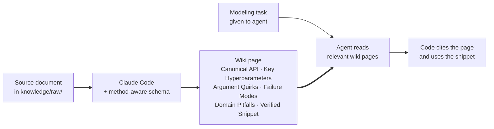

# llm-method-wiki

Give the link of this repo to an llm agent, let it clone and modify the agent.md for you.

> **A method-aware knowledge base that coding agents consult *before* writing model code — not a summary wiki they read for context.**

## Setup — wire this wiki into your agent's workspace

**This is the step most people miss.** Cloning this repo is not enough on its own. Your agent only reads what its workspace's schema file (`AGENTS.md` / `CLAUDE.md` / `GEMINI.md` — the one in your *workspace root*, **not** the one inside this repo) tells it to read. Until you paste the **Knowledge Base — Required** block (below) into that workspace file, the agent has no idea this wiki exists, and dropping papers into `knowledge/raw/` accomplishes nothing.

### Why there are two `AGENTS.md` files (and why the inside one is not enough)

After Step 1 below, you will have two similarly-named schema files on disk:

| File | Scope | What it controls |
|---|---|---|
| `llm-wiki-agent/AGENTS.md` (**inside** this repo) | Loaded only when an agent is working *inside the wiki repo itself* | Defines how to maintain the wiki — the ingest / query / lint / graph workflows. |
| `~/.openclaw/workspace/AGENTS.md` (**outside**, in your workspace root) | Loaded on **every** agent session in your workspace, for any project | Your workspace's general agent config. **This is the file you must modify.** Without the Knowledge Base block here, agents working on your *other* projects do not know this wiki exists. |

If you only have the inside `AGENTS.md`, the agent only reads the wiki rules when it happens to be working inside the wiki repo — which is never useful, because the whole point is for the wiki to be *consulted from outside* on modeling tasks for unrelated projects.

### Step 1 — Clone this repo into your workspace

```bash
cd ~/.openclaw/workspace          # or wherever your agent's workspace lives
git clone https://github.com/taikunudel/llm-method-wiki llm-wiki-agent
```

The folder name `llm-wiki-agent` is what the block below expects. If you choose another name, change every `llm-wiki-agent/` path in the block to match.

### Step 2 — Paste the Knowledge Base block into your *workspace* schema file

Which file to edit depends on the agent harness you use:

| Your agent harness | Edit this file |
|---|---|
| OpenClaw / Codex / OpenCode / any `AGENTS.md`-aware harness | `~/.openclaw/workspace/AGENTS.md` |
| Claude Code | `~/.openclaw/workspace/CLAUDE.md` |
| Gemini CLI | `~/.openclaw/workspace/GEMINI.md` |

Paste the following block anywhere near the top of that file (the literal block — the agent will read this verbatim, so do not edit the wording unless you understand what each rule does):

```markdown
## 📚 Knowledge Base — Required

A local wiki at `llm-wiki-agent/knowledge/wiki/` is part of your task context.
You **MUST** consult it before writing modeling, statistical, or
domain-specific code. Skipping it is not allowed.

**Required pre-task steps (in this order):**

1. Read `llm-wiki-agent/knowledge/wiki/index.md` — the catalog of every page.
2. For each domain term in your task, grep the wiki:
   `grep -rli <term> llm-wiki-agent/knowledge/wiki/`.
3. Read every matching page under `llm-wiki-agent/knowledge/wiki/sources/`,
   `llm-wiki-agent/knowledge/wiki/concepts/`, and
   `llm-wiki-agent/knowledge/wiki/examples/`.
4. Before invoking any package call that has a corresponding wiki page,
   read that page's `Argument Quirks` / `Failure Modes` / `Code Example`
   sections.

**Citation is mandatory:**

- Every modeling or domain decision MUST cite the wiki page(s) that support
  it via `[[PageName]]` in code comments AND in your trajectory's `cites`
  array.
- Empty `cites` on a substantive decision = task failure.
- Prefer `llm-wiki-agent/knowledge/wiki/examples/*.R` snippets — copy
  verbatim, then modify. Don't regenerate from training memory when an
  example exists.

**If the wiki has nothing relevant:** append an entry to
`llm-wiki-agent/knowledge/wiki/gaps.md` describing what was missing (use
the format documented at the top of that file), then proceed, citing
"no wiki support". The wiki maintainer reviews `gaps.md` to decide what
to ingest next. (Optional additional: if trajectory logging is enabled,
also log a `gap_surfaced` event — see the Task Trajectory section
further down in this README.)

**Layout (so you know where to look):**

- `llm-wiki-agent/knowledge/wiki/index.md`    — one-line catalog of every page (start here)
- `llm-wiki-agent/knowledge/wiki/overview.md` — current synthesis across all sources
- `llm-wiki-agent/knowledge/wiki/sources/`    — per-document summaries
- `llm-wiki-agent/knowledge/wiki/concepts/`   — methods, frameworks, distributions
- `llm-wiki-agent/knowledge/wiki/entities/`   — people, packages, organizations
- `llm-wiki-agent/knowledge/wiki/examples/`   — runnable snippets per method

The wiki captures package-specific gotchas, paper-recommended hyperparameters,
and silent-failure modes that aren't in your training data. Reading it is the
difference between "code that runs" and "code that runs correctly." This is
not optional.
```

### Step 3 — Verify it worked

Start a fresh agent session in your workspace (not inside the wiki repo — somewhere your agent normally works, like a project folder). Ask the agent a domain question that the seeded wiki covers, for example:

> *"What are the failure modes of HDtweedie?"*

If the block was loaded correctly, the agent will read pages from `llm-wiki-agent/knowledge/wiki/` and **cite them in its answer using `[[PageName]]` wikilinks** — for example `[[GroupedElasticNet]]`, `[[TweedieVariancePowerEstimation]]`. If you get a generic free-form answer with no citations, the block was not loaded — common causes:

- The block was pasted into the wrong file (the *inside* one, not the outside one).
- The agent session was started before the file was saved — restart it.
- Your harness loads a different filename than the one you edited — check the harness documentation.

### Step 4 (optional) — Enable trajectory logging for audit

If you want to later audit *whether* the agent actually used the wiki (versus skipping it and claiming it didn't help), paste the `📋 Task Trajectory` block further down in this README into the same workspace schema file. It tells the agent to write JSON event logs as it works, which an auditor can cross-check against git history.

---

## At a glance

| You do | Claude Code does | The agent later does |
|---|---|---|
| Drop a paper into `knowledge/raw/` | Builds a structured wiki page — `Canonical API`, `Argument Quirks`, `Failure Modes`, runnable snippet | Reads the page before writing model code, cites it, copies the snippet |
| Run `/wiki-query <question>` | Synthesizes an answer with `[[Page]]` citations | Treats the answer as a sourced memo, not a paraphrase from training memory |
| Run `/wiki-lint` periodically | Reports contradictions, orphans, missing snippets, gaps | Surfaces gaps when the wiki can't support a decision |
| Run `/wiki-graph` | Builds an interactive cross-link graph at `knowledge/graph/graph.html` | — |

## How it flows



## Why this exists

LLM coding agents are confidently wrong in predictable ways. A summary wiki doesn't fix the failure — only operational detail does:

| What agents get wrong | What this wiki captures |
|---|---|
| Fabricated function arguments | The exact `Canonical API` call from the paper or package docs |
| Library defaults that disagree with paper recommendations | A `Key Hyperparameters` table with paper-recommended values and sensible grids |
| Silent failures (unseen factor levels, `s = "lambda.min"` omitted, …) | `Argument Quirks` + `Failure Modes` sections, per page |
| Missing exposure / offset handling | A `Domain Pitfalls` section capturing knowledge the paper assumes but never states |
| Regenerating call sites from training memory | A `[[examples/<slug>]]` wikilink to a verified end-to-end snippet |

At coding time the workflow becomes: **read the wiki → cite the page → prefer copying the snippet → log a gap event when the wiki can't support a decision**.

## How it differs from RAG

This is not retrieval-augmented generation. RAG re-derives knowledge from raw chunks on every query; this compiles knowledge once into structured pages and keeps them current.

| RAG | llm-method-wiki |
|---|---|
| Re-derives knowledge every query | Compiles once, keeps current |
| Raw chunks as the retrieval unit | Structured wiki pages |
| No cross-references | Cross-references pre-built as `[[wikilinks]]` |
| Contradictions surface at query time (maybe) | Flagged at ingest time |
| No accumulation | Every source makes the wiki richer |

## What a wiki page looks like

A real page from the seeded corpus — [`wiki/sources/qian-2016-hdtweedie.md`](knowledge/wiki/sources/qian-2016-hdtweedie.md), truncated for the README:

```markdown
---
title: "Tweedie's Compound Poisson Model With Grouped Elastic Net"
type: source
tags: [method, HDtweedie, tweedie, regularization, insurance]
---

## Canonical API
​```R
cv_fit <- cv.HDtweedie(
  x      = x_train,    # numeric matrix, NO intercept, NO factor columns
  y      = y_train,
  group  = group_vec,  # one block per categorical (all dummies together)
  p      = 1.5,
  alpha  = 0.7,        # 1 = grouped lasso, 0 = grouped ridge
  nfolds = 5
)
y_hat <- predict(cv_fit, newx = x_test, s = "lambda.min", type = "response")
​```

## Argument Quirks
- `x` must be a numeric matrix with no intercept column — cv.HDtweedie adds it.
- Factor columns are not accepted; pre-expand with `model.matrix(~ . - 1)`.
- `predict()` silently returns an all-lambda matrix when `s` is omitted.
  Always pass `s = "lambda.min"`.

## Failure Modes
- Silent crash when test set has factor levels unseen in train.
- Convergence failure when p is too close to 1 or 2 — keep in (1.05, 1.95).
- Cross-validation unstable when >95% of responses are zero.

## Domain Pitfalls
- Group construction is the most common error: for a K-level categorical,
  group ALL K-1 dummies in one block, not each dummy separately.
- Exposure: pass via `weights`; the package does not parse offsets in formulas.
```

That's the shape every `[method]`/`[software]` source page takes. The full template (with `Key Hyperparameters` table, `Code Example` wikilink, `Connections`) is in [CLAUDE.md](CLAUDE.md).

## Quickstart (Claude Code)

```bash
git clone https://github.com/taikunudel/llm-method-wiki
cd llm-method-wiki
claude   # opens Claude Code in this directory
```

In Claude Code:

1. Drop a source document into `knowledge/raw/` (Markdown ingested directly; PDFs, .docx, .pptx, .html, etc. auto-convert via [markitdown](https://github.com/microsoft/markitdown)).
2. Say *"ingest knowledge/raw/your-file.md"* — Claude builds the source page, updates `index.md`, creates any new concept/entity pages, and logs the ingest.
3. Ask the wiki anything: *"What does the wiki say about Tweedie variance power?"*
4. Build the cross-link graph: *"build the knowledge graph"* — produces an interactive `knowledge/graph/graph.html`.
5. Periodically: *"lint the wiki"* (semantic checks) and *"health"* (fast structural checks).

No API key or Python script needed for the wiki itself — Claude Code reads [CLAUDE.md](CLAUDE.md) automatically and follows the workflows. The Python tools under `tools/` are optional accelerators (graph builder, health checker, etc.).

## Slash commands

| Command | What it does | Plain-English form |
|---|---|---|
| [`/wiki-ingest`](.claude/commands/wiki-ingest.md) | Process a file from `knowledge/raw/` into the wiki | *"ingest knowledge/raw/my-paper.md"* |
| [`/wiki-query`](.claude/commands/wiki-query.md) | Answer a question with citations | *"what does the wiki say about X?"* |
| [`/wiki-lint`](.claude/commands/wiki-lint.md) | Quality audit (orphans, contradictions, gaps) | *"lint the wiki"* |
| [`/wiki-graph`](.claude/commands/wiki-graph.md) | Build interactive `[[wikilink]]` graph | *"build the graph"* |

See [`.claude/commands/`](.claude/commands/) for the command definitions, and [CLAUDE.md](CLAUDE.md) for the full workflows each one invokes.

## What you get

- **Persistent wiki** — structured markdown pages that accumulate across sessions. Unlike a chat, nothing is lost.
- **Auto-created entity pages** — one per person, company, package, or project mentioned, updated each time a new source references it.
- **Auto-created concept pages** — one per idea, method, or framework, cross-referenced to every source that discusses it.
- **Living overview** — `knowledge/wiki/overview.md` is revised on every ingest to reflect the current synthesis across everything ingested.
- **Contradiction flags at ingest time** — when a new source conflicts with an existing claim, it's surfaced as you add it, not buried until query time.
- **Knowledge graph** — every page a node, every `[[wikilink]]` an edge, plus inferred implicit relationships and community detection (see [The graph](#the-graph)).
- **Lint reports** — orphan pages, broken links, missing entity pages, and data gaps with suggested sources to fill them.

## Use cases

The seeded corpus is actuarial, but the schema is general-purpose — any collection of sources works, and the method-aware templates are simply the flavor that kicks in for method/software papers.

<details>
<summary>Concrete workflows by domain (click to expand)</summary>

### Research

Going deep on a topic over weeks — papers, articles, reports.

```
/wiki-ingest knowledge/raw/papers/attention-is-all-you-need.md
/wiki-ingest knowledge/raw/papers/llama2.md
/wiki-ingest knowledge/raw/papers/rag-survey.md

# Entity pages (Meta AI, Google Brain) and concept pages
# (Attention, RLHF, Context Window) are created automatically.

/wiki-query "What are the main approaches to reducing hallucination?"
/wiki-query "How has context window size evolved across models?"

/wiki-lint
# → "No sources on mixture-of-experts — consider the Mixtral paper"
```

By the end you have a structured, interlinked reference — not a folder of PDFs you'll never reopen.

### Reading a book

File each chapter as you go; build pages for characters, themes, arguments.

```
/wiki-ingest knowledge/raw/book/chapter-01.md
/wiki-ingest knowledge/raw/book/chapter-02.md

/wiki-query "How has the protagonist's motivation evolved?"
/wiki-query "What contradictions exist in the author's argument so far?"

/wiki-graph   # → graph.html shows every character/theme and how they connect
```

Think fan wikis like Tolkien Gateway — built as you read, with the agent doing the cross-referencing.

### Personal knowledge base

Track goals, health, habits — file journal entries, articles, podcast notes.

```
/wiki-ingest knowledge/raw/journal/2026-01-week1.md
/wiki-ingest knowledge/raw/articles/huberman-sleep-protocol.md

/wiki-query "What patterns show up in my journal entries about energy?"
/wiki-query "What habits have I tried and what was the outcome?"
```

Concepts like "Sleep", "Exercise", "Deep Work" accumulate evidence from every source filed.

### Business / team intelligence

Feed in meeting transcripts, project docs, customer calls.

```
/wiki-ingest knowledge/raw/meetings/q1-planning-transcript.md
/wiki-ingest knowledge/raw/docs/product-roadmap-2026.md
/wiki-ingest knowledge/raw/calls/customer-interview-acme.md

/wiki-query "What feature requests have come up most across customer calls?"
/wiki-lint
# → "Project X mentioned in 5 pages but no dedicated page"
# → "Roadmap contradicts customer interview on priority of feature Y"
```

### Competitive analysis

Track a company, market, or technology over time.

```
/wiki-ingest knowledge/raw/competitors/openai-announcements.md
/wiki-ingest knowledge/raw/market/ai-funding-report-q1.md

/wiki-query "How do OpenAI and Anthropic differ on safety approach?"
/wiki-query "Competitive landscape summary as of today"
# → the agent shows the answer, then asks if you want to save it as a synthesis page
```

</details>

## Multi-format ingest

Drop any supported file into `knowledge/raw/` and ingest it — non-markdown is auto-converted via [markitdown](https://github.com/microsoft/markitdown) at ingest time, no separate step.

**Supported:** `.md` `.pdf` `.docx` `.pptx` `.xlsx` `.xls` `.html` `.htm` `.txt` `.csv` `.json` `.xml` `.rst` `.rtf` `.epub` `.ipynb` `.yaml` `.yml` `.tsv` `.wav` `.mp3`

Pass `--no-convert` to skip conversion and process only `.md` files.

<details>
<summary>Higher-fidelity conversion &amp; batch imports (click to expand)</summary>

For arXiv papers, `tools/pdf2md.py` gives higher-fidelity output than generic conversion:

```bash
python tools/pdf2md.py 2401.12345                       # by arXiv ID
python tools/pdf2md.py https://arxiv.org/abs/2401.12345 # by URL
python tools/pdf2md.py paper.pdf --backend marker        # complex multi-column PDFs
```

To pre-convert an entire directory (useful for bulk imports):

```bash
python tools/file_to_md.py --input_dir knowledge/raw/imports/
python tools/file_to_md.py --input_dir knowledge/raw/imports/ --delete_source  # remove originals
```

Optional dependencies (only needed for the formats/paths you use):

| Package | Install | Used for |
|---|---|---|
| [markitdown](https://github.com/microsoft/markitdown) | `pip install markitdown` | Auto-conversion of non-`.md` files (required for multi-format ingest) |
| [arxiv2md](https://github.com/ryansingman/arxiv2md) | `pip install arxiv2markdown` | arXiv papers via structured source |
| [Marker](https://github.com/VikParuchuri/marker) | `pip install marker-pdf` | Complex academic PDFs with multi-column layouts |
| [PyMuPDF4LLM](https://github.com/pymupdf/RAG) | `pip install pymupdf4llm` | Fast PDF extraction (no GPU needed) |
| [tqdm](https://github.com/tqdm/tqdm) | `pip install tqdm` | Progress bar for batch directory conversion |

</details>

## The graph

`/wiki-graph` builds the knowledge graph in two passes:

1. **Deterministic** — parses all `[[wikilinks]]` across wiki pages → edges tagged `EXTRACTED`.
2. **Semantic** — Claude infers implicit relationships not captured by wikilinks → edges tagged `INFERRED` (with a confidence score) or `AMBIGUOUS`.

Louvain community detection clusters nodes by topic. A SHA256 cache means only changed pages are reprocessed. Output is a self-contained `knowledge/graph/graph.html` — no server, opens in any browser.

## Repo layout

| Path | What's there |
|---|---|
| `knowledge/` | All knowledge-base content lives here. Subdirectories: `raw/` (immutable source documents — never edited by the agent), `wiki/` (the generated knowledge base — `index.md`, `overview.md`, `sources/`, `concepts/`, `entities/`, `examples/`, `syntheses/`, `log.md`), `wiki-naive/` (pre-regenerated state under the original non-method-aware schema, kept side-by-side so you can `diff` the new vs old templates on the same sources), `graph/` (auto-generated graph artifacts — `graph.json` + interactive `graph.html`), `logs/` (ingest run logs), `examples/` (demo corpora like `cjk-showcase/`). |
| `tools/` | Optional Python utilities — `build_graph.py`, `health.py`, `lint.py`, `ingest.py`, `query.py`, `heal.py`, `refresh.py`, `pdf2md.py`, `file_to_md.py`. |
| `.claude/commands/` | Claude Code slash-command definitions (`/wiki-*`). |
| `CLAUDE.md` / `AGENTS.md` / `GEMINI.md` | Identical schema/workflow instructions, read automatically by Claude Code, Codex/OpenCode, and Gemini CLI respectively. |
| `docs/` | Design notes and additional documentation. |

## What's seeded in the wiki

The `knowledge/wiki/` ships pre-populated with the auto-insurance / Tweedie modeling corpus used to develop this fork — useful both as a starting knowledge base and as a worked example of what the schema produces on real method papers:

- **8 source papers** — Smyth-Jorgensen (2002), Dunn-Smyth (2008), Frees-Meyers-Cummings (2011), Wood (2011), Zhang (2013), Qian-Yang-Zou (2016), Yang-Qian-Zou (2016), Delong-Lindholm-Wüthrich (2021).
- **8 runnable R examples** in `knowledge/wiki/examples/` — one per method, each calling its package against `cplm::AutoClaim`.
- **17 concept pages** — Tweedie distribution, GLM, GAM, gradient boosting, grouped elastic net, Gini index, adverse selection, etc.
- **14 entity pages** — authors and R packages.

To start with the schema only (no seed content):

```bash
rm -rf knowledge/wiki/* knowledge/raw/papers/*
git checkout knowledge/wiki/index.md knowledge/wiki/log.md knowledge/wiki/overview.md
```

## Using with other agents (openclaw, Codex, Gemini)

This wiki's schema files (the ones *inside* this repo) are mirrored across three filenames so the same wiki works under any harness:

| Harness | Schema file it loads on session start |
|---|---|
| Claude Code | `CLAUDE.md` |
| Codex / OpenCode / any `AGENTS.md`-aware harness | `AGENTS.md` |
| Gemini CLI | `GEMINI.md` |

These inside files define how the wiki gets maintained. They do **not** by themselves make your agent consult the wiki on tasks for other projects — that requires editing your *workspace* schema file as described in [Setup](#setup--wire-this-wiki-into-your-agents-workspace) at the top of this README.

<details>
<summary>Optional: trajectory logging for audit (click to expand)</summary>

If you want to later audit *whether* the agent used the wiki, also paste this `## 📋 Task Trajectory` block into the same `AGENTS.md`. It tells the agent to write JSON events to `audit/trajectories/<task-id>.jsonl` as it works.

```markdown
## 📋 Task Trajectory — Log What You Do

When working on a modeling, coding, or domain task that consults the wiki at
`llm-wiki-agent/knowledge/wiki/`, record what you do as you do it so the work can be
audited later.

**Where:** `audit/trajectories/<task-id>.jsonl` at the workspace root. Create
the `audit/trajectories/` folder if it doesn't exist. `<task-id>` is a short
slug — e.g. `auto-ins-2026-05-16` or whatever uniquely identifies this run.

**Format:** one JSON object per line, appended in real time (not batched at
the end — timestamps matter to the auditor). Required event types:

| event | required fields |
|---|---|
| `task_start` | `ts`, `task_id`, `goal`, `wiki_root`, `git_branch_start` |
| `wiki_read` | `ts`, `task_id`, `page_id`, `bytes_read`, `sha256` |
| `decision` | `ts`, `task_id`, `summary`, `cites: [page_id,...]`, `rationale` |
| `code_edit` | `ts`, `task_id`, `path`, `lines_added`, `lines_removed`, `cites: [page_id,...]` |
| `code_run` | `ts`, `task_id`, `cmd`, `exit_code`, `summary` |
| `gap_surfaced` | `ts`, `task_id`, `concept`, `expected_page` |
| `task_end` | `ts`, `task_id`, `summary`, `git_branch_end`, `git_sha_end` |

`ts` is ISO-8601 UTC (`2026-05-16T14:22:01Z`). `page_id` is the path relative
to `knowledge/wiki/` (e.g. `concepts/TweedieDistribution.md`). `sha256` is the hash of
the page contents at the time you read it — the auditor recomputes from git
to detect fabricated reads.

**Rules:**
- Append-only. Never edit or delete past entries.
- Emit each event immediately after the action it describes, not in a batch.
- Every `decision` and `code_edit` MUST have a non-empty `cites` array if the
  wiki informed it. Empty cites on a substantive decision = faithfulness fail.
- Mirror every `Read` of a `knowledge/wiki/**` file as a `wiki_read` event.

**Honesty:** the auditor cross-checks your trajectory against git history
(`git log -p`, file mtimes) and any harness-level tool logs. Omissions and
fabrications are detectable. Be complete — it's cheaper than getting caught.
```

</details>

## Obsidian integration

The wiki is designed to browse seamlessly in [Obsidian](https://obsidian.md) — the agent maintains consistent `[[wikilinks]]`, so you get a naturally growing graph in your vault.

<details>
<summary>Vault symlink pattern &amp; recommended config (click to expand)</summary>

To keep the repo separate from your main vault, symlink the `knowledge/wiki/` folder in:

```bash
ln -sfn ~/llm-method-wiki/wiki ~/your-obsidian-vault/wiki
```

Then write to `knowledge/raw/` (or use the [Obsidian Web Clipper](https://obsidian.md/clipper)) to queue items for ingestion. If you move the repo, update the symlink or `knowledge/wiki/` will appear missing in Obsidian.

- **Graph View:** filter out `index.md` and `log.md` (`-file:index.md -file:log.md`) so they don't become gravity wells.
- **Dataview:** the [Dataview](https://blacksmithgu.github.io/obsidian-dataview/) plugin can query the YAML frontmatter the agent injects (e.g. `type: source`, `tags: [diary]`).

</details>

## Tech stack

NetworkX + Louvain + Claude + vis.js. No server, no database — everything is plain markdown files, running entirely locally.

## Tips

- The wiki is a plain git repo — you get version history of every page for free.
- Query answers are shown before they're filed; say yes to save one as a synthesis page, and your explorations compound just like ingested sources.
- The standalone Python scripts in `tools/` also run without a coding agent — the ones that call an LLM (e.g. `lint.py`, `query.py`) require `ANTHROPIC_API_KEY`, while `health.py` is deterministic and needs no key.

## Related

- [graphify](https://github.com/safishamsi/graphify) — graph-based knowledge-extraction skill (inspiration for the graph layer).
- [Vannevar Bush's Memex (1945)](https://en.wikipedia.org/wiki/Memex) — the original vision this resembles.

## Credits & lineage

| Project | Role |
|---|---|
| [SamurAIGPT/llm-wiki-agent](https://github.com/SamurAIGPT/llm-wiki-agent) | Direct upstream this fork descends from |
| [nashsu/llm_wiki](https://github.com/nashsu/llm_wiki) | Original Tauri desktop app that inspired the approach |

**What this fork adds on top:**

- Method-aware schema (`Canonical API`, `Key Hyperparameters`, `Argument Quirks`, `Failure Modes`, `Domain Pitfalls`).
- Concept-page template variants — `Method/Software`, `Domain`, `Diagnostic`.
- `knowledge/wiki/examples/` directory of verified runnable snippets, one per method.
- Side-by-side `knowledge/wiki/` vs `knowledge/wiki-naive/` so you can `diff` the new vs. old schema on the same sources.
- Three-agent compatibility via mirrored `CLAUDE.md` / `AGENTS.md` / `GEMINI.md`.
- Domain-specific source templates (Diary / Journal, Meeting Notes) alongside the generic one.

## License

MIT — see [`LICENSE`](LICENSE). Inherits from upstream.
